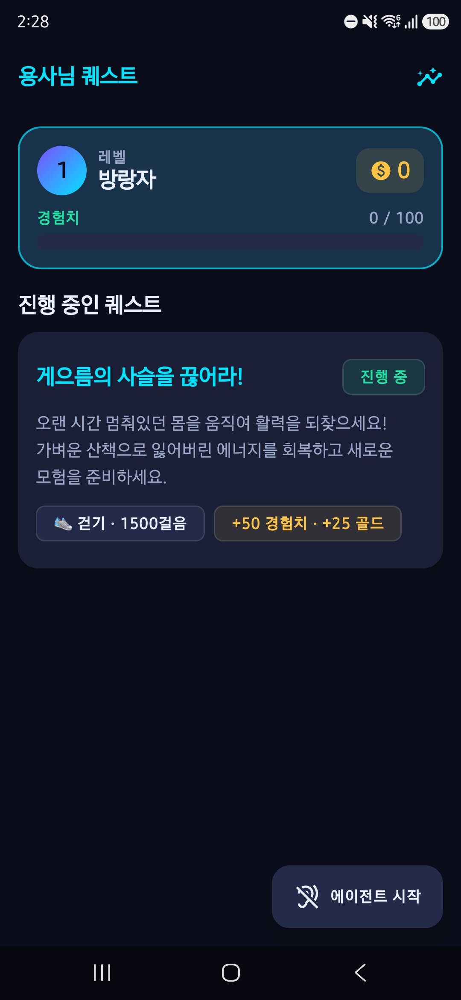
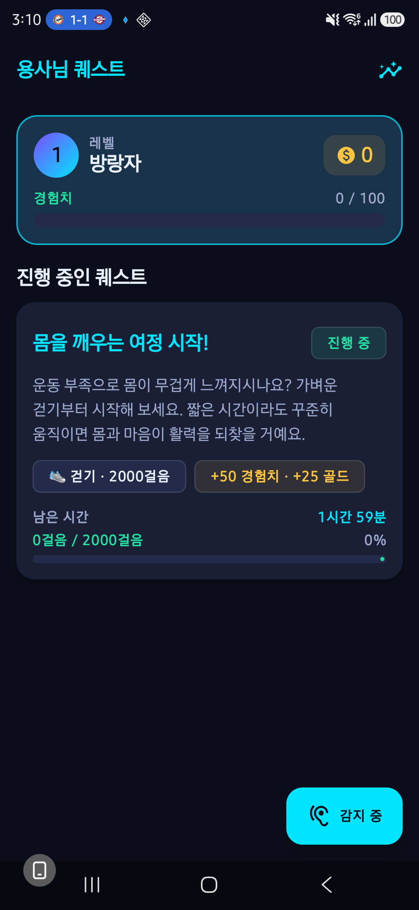
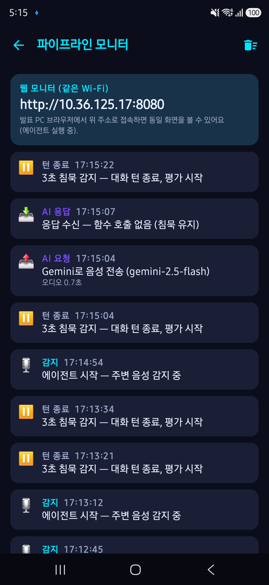
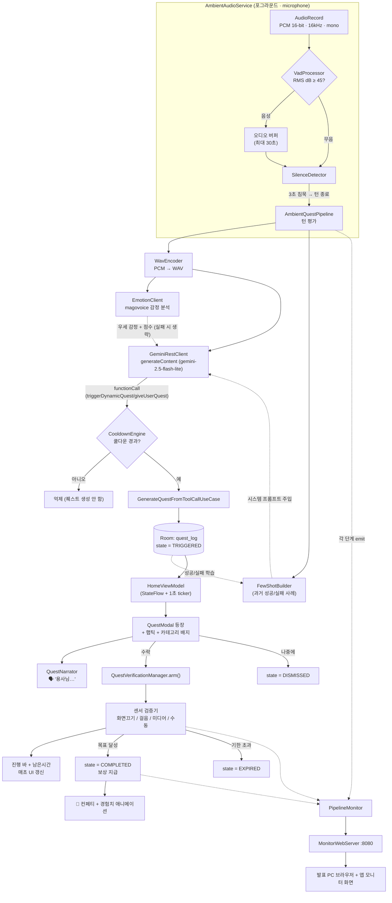
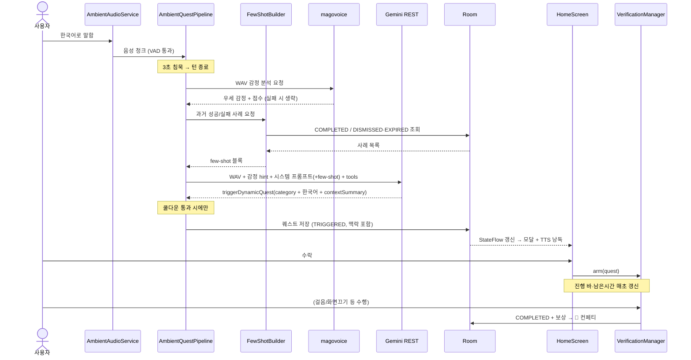
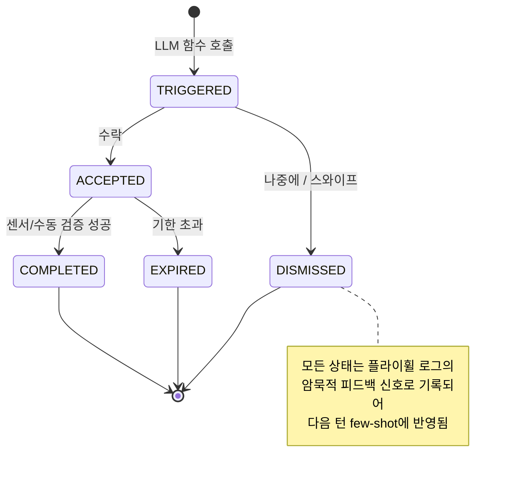
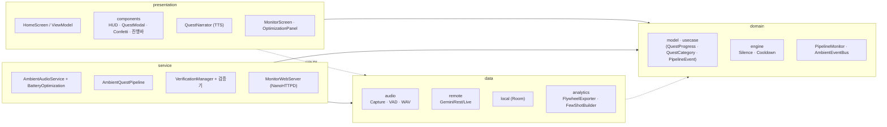

# 용사님 퀘스트 (ChronicleQuest)

맥락을 인식하는 **게임화 라이프 어시스턴트** Android 앱입니다. 포그라운드 서비스가 주변
음성을 캡처하고, 로컬 VAD로 음성 구간만 걸러, **Gemini**에 보내 함수 호출로 RPG 퀘스트를
동적으로 생성합니다. 퀘스트는 기기 센서로 검증되고 EXP/골드로 보상되며, 모든 퀘스트와
사용자 반응은 Room에 기록되어 **온디바이스 자가 개선(few-shot)** 에 쓰입니다.

퀘스트가 등장하면 신뢰감 있는 한국어 여성 목소리가 **"용사님…"** 하고 읽어줍니다.

<p align="center">
  
  
  
</p>
<p align="center"><sub>홈(HUD) · 진행도/남은시간 · 실시간 파이프라인 모니터</sub></p>

---

## 주요 기능

- 🎙️ **항상 켜진 주변 음성 캡처** — `microphone` 포그라운드 서비스, 백그라운드/화면 off에서도 유지
- 🔊 **로컬 RMS/VAD 게이트** — 음성 구간만 전송해 대역폭·토큰 절약
- 🧠 **Gemini 함수 호출** — `triggerDynamicQuest`(만능 동적 함수, category 포함) / `giveUserQuest` / `sendInsightTip`
- ❤️ **음성 감정 분석(magovoice)** — 매 턴 음성에서 우세 감정(기쁨/중립/분노/슬픔/놀람)을 추출해 Gemini 맥락에 주입 → 공감 퀘스트(슬픔·분노엔 위로/휴식, 기쁨엔 격려/도전)
- ⏱️ **3초 침묵 턴 종료 + 쿨다운** — 말 중간 끊김 방지, 과도한 퀘스트 억제(데모 1분 · 프로덕션 20분)
- 🎮 **Material 3 다크 RPG UI** — 레벨/경험치 바/골드 HUD, 퀘스트 모달, Canvas 컨페티
- 📈 **진행도 & 유효시간** — 진행 바(걸음/화면끔)·남은 시간 카운트다운을 매초 표시
- 📱 **센서 검증** — 화면 끄기 / 걸음 수 / 미디어 재생 / 직접 인증 (걸음수 **실시간 반영**)
- 🗣️ **TTS 음성 안내** — 한국어 여성 목소리로 퀘스트 낭독, 액션 시 중단
- 🔋 **백그라운드 상시 감지** — 배터리 최적화 제외 + 미디어 재생 중에도 캡처 유지(통화만 일시정지)
- 🔁 **온디바이스 자가 개선** — 사용자 본인의 성공/실패 사례를 시스템 프롬프트에 few-shot으로 주입
- 📊 **실시간 파이프라인 모니터(발표용)** — 앱 내장 웹서버로 데이터 흐름을 브라우저/앱에서 실시간 관찰
- 🇰🇷 **전체 한국어** — UI와 AI가 생성하는 퀘스트 모두 한국어

---

## 전체 플로우



## 퀘스트 생명주기 (시퀀스)



## 퀘스트 상태 머신



## 아키텍처 (Clean Architecture)



---

## 기술 스택

- **Kotlin · Jetpack Compose** (Material 3, 다크 RPG 테마)
- **Clean Architecture** (`data` / `domain` / `presentation` / `service`) + **MVI**
- **Hilt** DI · **Room** (KSP) · **Coroutines/Flow**
- **OkHttp** (REST + WebSocket) · **kotlinx.serialization** · **NanoHTTPD**(모니터 웹서버)
- 단일 모듈 `app`, 패키지 루트 `com.chroniclequest`

### 주요 구성요소

| 레이어 | 핵심 클래스 |
|--------|-------------|
| `data/audio` | `AudioCaptureManager`, `VadProcessor`, `WavEncoder`, `PcmUtils` |
| `data/remote` | `GeminiRestClient`(기본), `GeminiLiveClient`(WebSocket), `GeminiAgentConfig`, `EmotionClient`(magovoice 음성 감정) |
| `data/local` | `AppDatabase`(v2), `QuestLogEntity`(라이브 퀘스트 + 플라이휠 로그 겸용) |
| `data/analytics` | `FlywheelExporter`(JSON 내보내기), `FewShotBuilder`(런타임 프롬프트 주입) |
| `domain/model` | `Quest`, `QuestProgress`, `QuestCategory`, `QuestState`, `PipelineEvent`, `EmotionResult`, `UserStats` |
| `domain` | `PipelineMonitor`(모니터 이벤트 버스), `AmbientEventBus` |
| `domain/engine` | `SilenceDetector`(3초), `CooldownEngine`(쿨다운) |
| `service` | `AmbientAudioService`, `AmbientQuestPipeline`, `QuestVerificationManager` + 검증기, `MonitorWebServer`, `BatteryOptimization` |
| `presentation` | `HomeScreen`, `MonitorScreen`, `components`, `QuestNarrator`(TTS), `OptimizationPanelScreen` |

---

## AI 함수 (Tool Calling)

| 함수 | 용도 |
|------|------|
| **`triggerDynamicQuest`** (주력) | 만능 동적 퀘스트 — `category`(HEALTH/STUDY/REST/SOCIAL) + `targetSensor`(SCREEN_OFF/STEP_COUNT/USER_CHECK) + title/description/targetValue/reward/contextSummary |
| `giveUserQuest` (호환) | 기존 동적 함수(category 없음). `verificationMethod` 사용 |
| `sendInsightTip` | 추적 불가한 가벼운 격려/통찰 |

> 두 퀘스트 함수는 **동일한 생성 경로**(`GenerateQuestFromToolCallUseCase` → Room → `QuestVerificationManager`)로 수렴합니다.
> `targetSensor`의 `USER_CHECK`는 내부 `USER_MANUAL`로 매핑됩니다.

### AI 트랜스포트 — 두 가지 경로

| 경로 | 사용 시점 | 동작 |
|------|-----------|------|
| **REST 폴백** (기본) | Live 권한 없는 키 | 3초 침묵마다 누적 음성을 **WAV 한 클립**으로 `generateContent`(`gemini-2.5-flash-lite`)에 전송 |
| **Live (WebSocket)** | Live(`bidiGenerateContent`) 권한 있는 키 | base64 PCM 실시간 스트리밍, 서버 `toolCall` 수신 |

> 대부분의 Gemini 키는 Live API가 비활성(`1008` 거부)이라 **REST 폴백이 기본 경로**입니다. API 키는 URL이
> 아닌 **`x-goog-api-key` 헤더**로 전달해 로그 노출을 막습니다.
>
> **모델 선택**: 이 앱(오디오 입력 위주·잦은 호출·단순 함수 호출)에는 **`gemini-2.5-flash-lite`** 를 씁니다 —
> 오디오 입력 3.3배·출력 6배 저렴, 무료 티어 RPM 2배(`429` 완화), 더 빠름. `429`는 빈 응답이 아니라
> 명확한 에러로 처리해 모니터에 "API 호출 한도 초과(429)"로 표시됩니다.

---

## 음성 감정 분석 (magovoice)

매 턴, Gemini로 보내는 동일한 WAV를 **magovoice 감정 인식 API**에도 보내 사용자의 감정을 읽고, 그
결과를 Gemini 요청 맥락에 넣어 **공감하는 퀘스트**를 만듭니다.

- **`EmotionClient`** — `POST https://api.magovoice.com/emotion_recognition/v1/run?is_speech=false`
  (multipart `file`/`content_id`/`out_dir`). **인증 키 불필요**, 우리가 만드는 WAV를 그대로 수락.
  응답의 `best_emotion` + `emotion`(HAPPINESS/NEUTRAL/ANGRY/SADNESS/SURPRISE 점수)을 `EmotionResult`로 변환.
- **best-effort** — 실패/타임아웃(15초) 시 `null`을 반환하고 파이프라인은 그대로 진행(감정 없이 퀘스트 생성).
- **주입** — `EmotionResult.toPromptHint()`("음성 감정 분석 — 우세 감정: 슬픔 …")를 오디오 `Part` 뒤에 텍스트
  `Part`로 추가. 시스템 프롬프트가 "슬픔·분노엔 위로/휴식(REST), 기쁨엔 격려/도전"으로 category·말투를 조정.
- **모니터** — `EMOTION`(❤️) 단계가 "감정 분석: {우세 감정} 우세 + 점수 요약"으로 표시됩니다.

---

## 실시간 파이프라인 모니터 (발표용)

데이터 흐름(음성 → Gemini → 퀘스트)을 **웹페이지/앱에서 실시간**으로 볼 수 있습니다.

- **2열 구성** — **왼쪽 = 앱 이벤트**(감지 → 턴 종료 → 감정 → AI 요청 → AI 응답 → 함수 호출 →
  쿨다운 → 퀘스트 생성 → 검증 → 보상 파이프라인 흐름), **오른쪽 = 서버 통신**(Gemini·magovoice의
  실제 **요청/응답** — HTTP 라인 + 본문). 각 이벤트는 `channel`(`PIPELINE`/`NETWORK`)로 분류됩니다.
- **`PipelineMonitor`** — 각 단계가 이벤트를 emit하는 전역 버스. `log(stage, msg, detail, channel)` +
  서버 통신용 `netRequest`/`netResponse` 헬퍼. `GeminiRestClient`·`EmotionClient`가 요청/응답을 직접 기록
  (Gemini 요청의 **base64 오디오는 요약·생략**, API 키는 미표시).
- **`MonitorWebServer`**(NanoHTTPD, 포트 **8080**) — 에이전트 시작 시 자동 기동. `monitor.html` 서빙 +
  `/events.json` 피드(CORS 개방).
- **웹 페이지** — `app/src/main/assets/monitor.html`(앱 서빙) + [`docs/index.html`](docs/index.html)(GitHub Pages 사본).
  1초 폴링, 2열 타임라인(좁은 화면에선 세로로 스택).
- **앱 내 `MonitorScreen`** — 폰 화면은 좁아 **왼쪽(앱 이벤트)만** 표시(서버 통신 상세는 발표 PC 2열 뷰).

### 발표 사용법
1. 폰: 앱 실행 → **에이전트 시작** (웹서버 자동 기동)
2. 앱 **모니터 화면**(홈 상단 📺 아이콘)에 표시되는 `http://<폰IP>:8080` 확인
3. **발표 PC 브라우저**에서 그 주소 접속 → 2열 실시간 뷰(왼쪽 앱 이벤트 · 오른쪽 서버 통신)
4. 말을 걸면 왼쪽엔 파이프라인 단계, 오른쪽엔 Gemini·magovoice 요청/응답 본문이 흐름. **쿨다운 1분**(데모)이라 빠른 반복 시연 가능

> ⚠️ 같은 Wi-Fi(기기 간 통신 허용)가 필요합니다. 회사/게스트망은 기기 격리(AP isolation)로 막힐 수
> 있으니 **휴대폰 핫스팟**을 쓰면 확실합니다. GitHub Pages(HTTPS)에서 폰(HTTP)으로의 직접 연결은
> 브라우저 mixed-content 정책상 막히므로, 실시간 메인은 **폰 IP 직접 접속**입니다.

---

## 퀘스트 검증 방식

| 메서드 | 검증 방법 |
|--------|-----------|
| `SCREEN_OFF` | `BroadcastReceiver`(화면 on/off) — N분간 화면 꺼짐 유지 |
| `STEP_COUNT` | **`TYPE_STEP_DETECTOR`(걸음마다 즉시 이벤트)** 우선 + `TYPE_STEP_COUNTER` fallback — 걸음 단위 실시간 반영 |
| `MEDIA_PLAY` | `AudioManager.isMusicActive` 폴링 (`MediaSessionManager`는 알림 접근 권한 필요 — 후속 과제) |
| `USER_MANUAL` / `USER_CHECK` | 인앱 체크인 버튼 |

> ⚠️ 걸음 센서는 **`ACTIVITY_RECOGNITION`(신체 활동) 런타임 권한**이 있어야 이벤트가 옵니다. 앱은 에이전트
> 시작 시 마이크·알림과 함께 이 권한도 요청합니다. (권한이 없으면 진행도가 0에 멈춥니다.)

진행도는 `QuestVerifier.progress(now)` → `QuestVerificationManager.progressOf()` → `HomeViewModel`의
1초 ticker → 카드 진행 바·남은시간으로 표시됩니다.

## 자가 개선 루프 (플라이휠 → few-shot)

외부 서버 없이, 사용자 본인의 데이터로 에이전트가 점점 더 잘 맞춰집니다.

1. **연료 수집** — 퀘스트 함수가 `contextSummary`(당시 상황 한국어 요약)를 함께 반환해
   `QuestLogEntity.conversation_summary`에 저장. 반응(수락/완료/무시/만료)도 상태로 기록.
2. **런타임 주입** — 매 턴 평가 직전 `FewShotBuilder`가 성공·실패 사례를 추려 한국어 few-shot 블록으로
   만들어 `GeminiAgentConfig.systemInstruction(fewShot)`에 주입.
3. **오프라인 분석** — `OptimizationPanelScreen`이 `FlywheelExporter` JSON을 복사/공유.

```
참고: 이 사용자의 과거 반응 사례다. 성공 패턴은 살리고 실패 패턴은 피하라.
[성공] (휴식) 상황: "폰을 오래 봐서 눈이 피곤하다고 함" → 제안: "화면 끄고 휴식" (SCREEN_OFF) → 완료함
[실패] (소셜) 상황: "업무 마감으로 바쁘게 집중하던 중" → 제안: "맛집 탐방" (USER_MANUAL) → 무시함
```

## 백그라운드 상시 감지

- **포그라운드 서비스**(`type=microphone`)로 앱이 백그라운드/화면 off에서도 캡처 유지.
- **배터리 최적화 제외**(`BatteryOptimization`, `REQUEST_IGNORE_BATTERY_OPTIMIZATIONS`)로 OEM 배터리 킬러 대응.
- **오디오 포커스 정책** — 미디어 재생(`AUDIOFOCUS_LOSS`)엔 캡처 유지, 통화(`LOSS_TRANSIENT`)만 일시정지.
  프로세스 재시작 시 `restoreArmed()`로 진행 중 퀘스트 검증 복원.

---

## 설정 & 빌드

> **JDK 주의**: Android Gradle Plugin은 JDK 25를 지원하지 않습니다. [`gradle.properties`](gradle.properties)의
> `org.gradle.java.home`으로 데몬을 **Corretto 21**에 고정합니다(Java 17 바이트코드). 경로가 다르면 수정하세요.

1. git-ignore된 `local.properties`에 키 입력:
   ```properties
   sdk.dir=/path/to/Android/sdk
   GEMINI_API_KEY=your_key_here
   ```
   키는 <https://aistudio.google.com/apikey> 에서 발급. 키가 없어도 빌드·실행됩니다(에이전트는 대기).

2. 빌드 / 설치:
   ```bash
   ./gradlew assembleDebug
   ./gradlew installDebug   # 에뮬레이터/실기기 (API 29+)
   ```

3. 실행 → **`에이전트 시작`** → **마이크·알림·신체 활동(걸음)·배터리 최적화 제외** 허용 → 주변을 말하면
   약 3초 침묵 후 퀘스트가 등장하고 TTS가 낭독합니다. ("운동을 안 해서 힘들다", "너무 많이 먹어서 배부르다"
   같은 명확한 신호면 퀘스트가 잘 뜹니다.)

> 💡 데모용 쿨다운은 **1분**(`CooldownEngine.DEFAULT_COOLDOWN_MS`)입니다. 프로덕션은 20분으로
> 되돌리세요. 인메모리라 앱을 완전 종료 후 재실행하면 쿨다운이 초기화됩니다.

---

## 처음부터 재생성

빈 저장소에서 이 앱을 동일하게 재현하기 위한 단일 프롬프트는 [`PROMPT.md`](PROMPT.md)에 있습니다.
