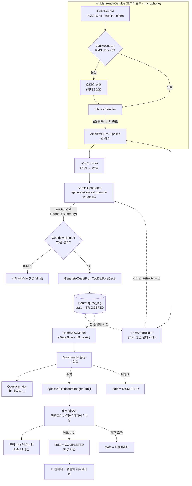
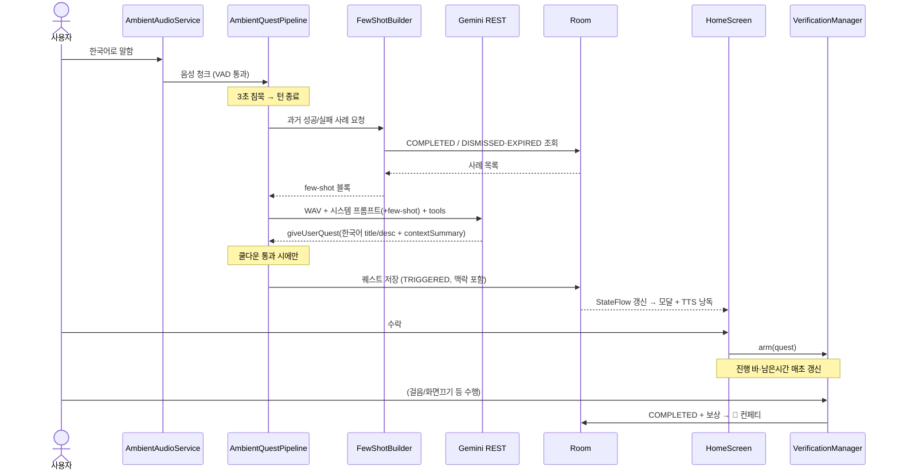
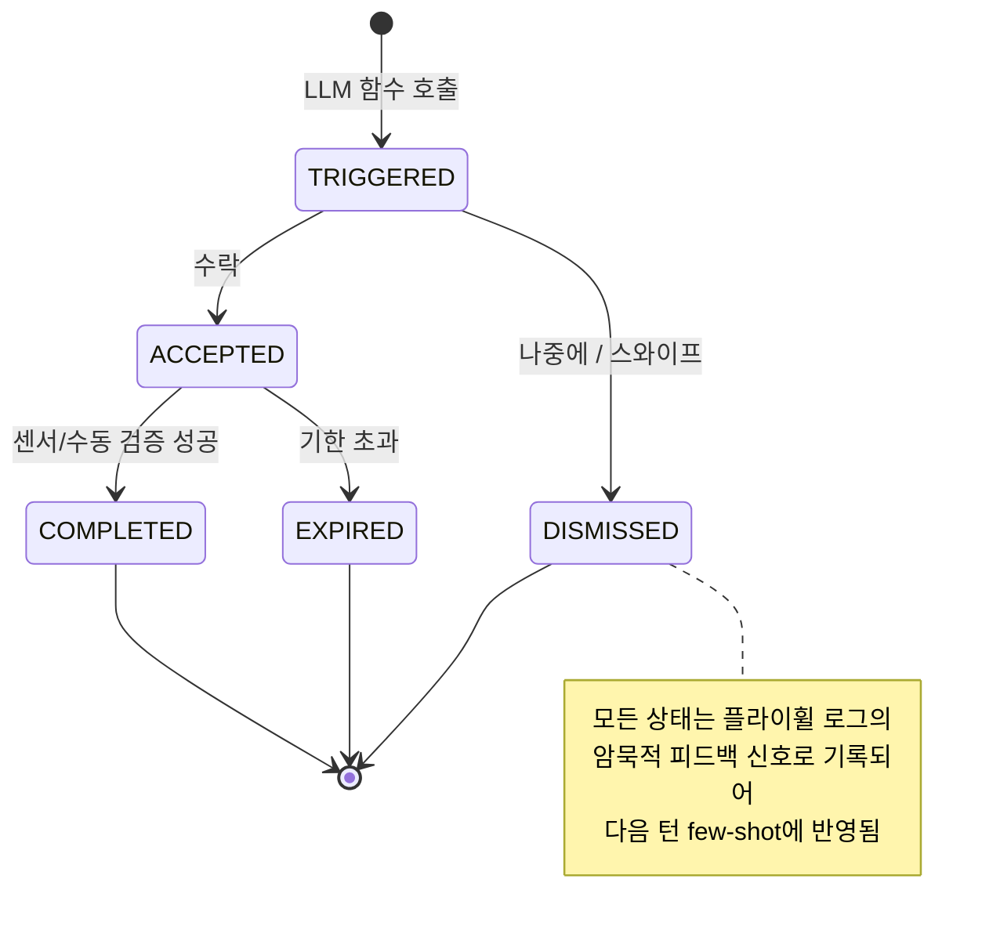
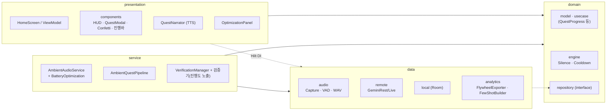

# 용사님 퀘스트 (ChronicleQuest)

맥락을 인식하는 **게임화 라이프 어시스턴트** Android 앱입니다. 포그라운드 서비스가 주변
음성을 캡처하고, 로컬 VAD로 음성 구간만 걸러, **Gemini**에 보내 함수 호출로 RPG 퀘스트를
동적으로 생성합니다. 퀘스트는 기기 센서로 검증되고 EXP/골드로 보상되며, 모든 퀘스트와
사용자 반응은 Room에 기록되어 **온디바이스 자가 개선(few-shot)** 에 쓰입니다.

퀘스트가 등장하면 신뢰감 있는 한국어 여성 목소리가 **"용사님…"** 하고 읽어줍니다.

---

## 주요 기능

- 🎙️ **항상 켜진 주변 음성 캡처** — `microphone` 포그라운드 서비스, 백그라운드/화면 off에서도 유지
- 🔊 **로컬 RMS/VAD 게이트** — 음성 구간만 전송해 대역폭·토큰 절약
- 🧠 **Gemini 함수 호출** — 라이프스타일 문제·감정을 감지해 `giveUserQuest` / `sendInsightTip` 호출
- ⏱️ **3초 침묵 턴 종료 + 20분 쿨다운** — 말 중간 끊김 방지, 과도한 퀘스트 억제
- 🎮 **Material 3 다크 RPG UI** — 레벨/경험치 바/골드 HUD, 퀘스트 모달, Canvas 컨페티
- 📈 **진행도 & 유효시간** — 수락한 퀘스트의 진행 바(걸음/화면끔)·남은 시간 카운트다운을 매초 표시
- 📱 **센서 검증** — 화면 끄기 / 걸음 수 / 미디어 재생 / 직접 인증
- 🗣️ **TTS 음성 안내** — 한국어 여성 목소리로 퀘스트 낭독, 액션 시 중단
- 🔋 **백그라운드 상시 감지** — 배터리 최적화 제외 + 미디어 재생 중에도 캡처 유지(통화만 일시정지)
- 🔁 **온디바이스 자가 개선** — 사용자 본인의 성공/실패 사례를 시스템 프롬프트에 few-shot으로 주입
- 🇰🇷 **전체 한국어** — UI와 AI가 생성하는 퀘스트 모두 한국어

---

## 전체 플로우



## 퀘스트 생명주기 (시퀀스)



## 퀘스트 상태 머신



## 아키텍처 (Clean Architecture)



---

## 기술 스택

- **Kotlin · Jetpack Compose** (Material 3, 다크 RPG 테마)
- **Clean Architecture** (`data` / `domain` / `presentation` / `service`) + **MVI**
- **Hilt** DI · **Room** (KSP) · **Coroutines/Flow**
- **OkHttp** (REST + WebSocket) · **kotlinx.serialization**
- 단일 모듈 `app`, 패키지 루트 `com.chroniclequest`

### 주요 구성요소

| 레이어 | 핵심 클래스 |
|--------|-------------|
| `data/audio` | `AudioCaptureManager`, `VadProcessor`, `WavEncoder`, `PcmUtils` |
| `data/remote` | `GeminiRestClient`(기본), `GeminiLiveClient`(WebSocket), `GeminiAgentConfig` |
| `data/local` | `AppDatabase`, `QuestLogEntity`(라이브 퀘스트 + 플라이휠 로그 겸용) |
| `data/analytics` | `FlywheelExporter`(JSON 내보내기), `FewShotBuilder`(런타임 프롬프트 주입) |
| `domain/model` | `Quest`, `QuestProgress`, `QuestState`, `UserStats` |
| `domain/engine` | `SilenceDetector`(3초), `CooldownEngine`(20분) |
| `domain/usecase` | 퀘스트 생성 / 수락 / 완료 |
| `service` | `AmbientAudioService`(FGS), `AmbientQuestPipeline`, `QuestVerificationManager` + 검증기, `BatteryOptimization` |
| `presentation` | `HomeScreen`, `components`(진행 바 포함), `QuestNarrator`(TTS), `OptimizationPanelScreen` |

---

## AI 트랜스포트 — 두 가지 경로

| 경로 | 사용 시점 | 동작 |
|------|-----------|------|
| **REST 폴백** (기본) | Live 권한 없는 키 | 3초 침묵마다 누적 음성을 **WAV 한 클립**으로 `generateContent`(`gemini-2.5-flash`)에 전송 → 함수 호출 파싱 |
| **Live (WebSocket)** | Live(`bidiGenerateContent`) 권한 있는 키 | base64 PCM 실시간 스트리밍, 서버 `toolCall` 수신 |

> 대부분의 Gemini 키는 Live API가 비활성(`1008` 거부)이라 **REST 폴백을 기본 경로**로 둡니다.
> 두 경로는 동일한 시스템 프롬프트·tool 스키마·쿨다운·퀘스트 로직을 공유하며, API 키는 URL이 아닌
> **`x-goog-api-key` 헤더**로 전달해 로그 노출을 막습니다.

## 진행도 & 유효시간

수락한 퀘스트는 카드에서 실시간 상태를 보여줍니다.

- **진행 바** — `QuestVerifier.progress(now)`가 노출하는 값(`StepCountVerifier` 걸음 델타,
  `ScreenOffVerifier` 연속 화면끔 시간)을 `QuestVerificationManager.progressOf()`로 모아 표시
  ("N걸음 / M걸음 · P%").
- **남은 유효시간** — `Quest.deadlineAt` 기준 카운트다운("남은 시간 1시간 36분", 5분 미만이면 강조).
- `HomeViewModel`의 1초 ticker가 `QuestUiModel`을 매초 재계산해 카운트다운·진행을 갱신합니다.

## 퀘스트 검증 방식

| 메서드 | 검증 방법 |
|--------|-----------|
| `SCREEN_OFF` | `BroadcastReceiver`(화면 on/off) — N분간 화면 꺼짐 유지 |
| `STEP_COUNT` | `TYPE_STEP_COUNTER` 델타 — 시작 기준 N걸음 |
| `MEDIA_PLAY` | `AudioManager.isMusicActive` 폴링 (`MediaSessionManager`는 알림 접근 권한 필요 — 후속 과제) |
| `USER_MANUAL` | 인앱 체크인 버튼 |

## 자가 개선 루프 (플라이휠 → few-shot)

외부 서버 없이, 사용자 본인의 데이터로 에이전트가 점점 더 잘 맞춰집니다.

1. **연료 수집** — `giveUserQuest`가 `contextSummary`(당시 상황 한국어 요약)를 함께 반환해
   `QuestLogEntity.conversation_summary`에 저장. 반응(수락/완료/무시/만료)도 상태로 기록.
2. **런타임 주입** — 매 턴 평가 직전 `FewShotBuilder`가 성공(COMPLETED)·실패(DISMISSED/EXPIRED)
   사례를 추려 한국어 few-shot 블록으로 만들어 `GeminiAgentConfig.systemInstruction(fewShot)`에 주입.
3. **오프라인 분석** — `OptimizationPanelScreen`이 `FlywheelExporter` JSON을 복사/공유(오프라인 튜닝용).

```
참고: 이 사용자의 과거 반응 사례다. 성공 패턴은 살리고 실패 패턴은 피하라.
[성공] 상황: "폰을 오래 봐서 눈이 피곤하다고 함" → 제안: "화면 끄고 휴식" (SCREEN_OFF) → 완료함
[실패] 상황: "업무 마감으로 바쁘게 집중하던 중" → 제안: "맛집 탐방" (USER_MANUAL) → 무시함
```

## 백그라운드 상시 감지

- **포그라운드 서비스**(`type=microphone`)로 앱이 백그라운드로 가거나 화면을 꺼도 캡처 유지.
- **배터리 최적화 제외**(`BatteryOptimization`) — 시작 시 `REQUEST_IGNORE_BATTERY_OPTIMIZATIONS`로
  사용자에게 제외를 요청해 삼성 등 공격적 OEM 배터리 관리에서도 FGS 생존.
- **오디오 포커스 정책** — 다른 앱의 미디어 재생(`AUDIOFOCUS_LOSS`)에는 캡처를 멈추지 않고, 통화 등
  일시 점유(`AUDIOFOCUS_LOSS_TRANSIENT`)에만 잠깐 멈췄다 종료 시 재개. 프로세스 재시작 시
  `restoreArmed()`로 진행 중 퀘스트 검증을 복원.

---

## 설정 & 빌드

> **JDK 주의**: Android Gradle Plugin은 JDK 25를 지원하지 않습니다. 데몬을 **Corretto 21**로
> 고정하기 위해 [`gradle.properties`](gradle.properties)의 `org.gradle.java.home`을 사용합니다
> (Java 17 바이트코드 컴파일). 경로가 다르면 수정하세요.

1. git-ignore된 `local.properties`에 키 입력:
   ```properties
   sdk.dir=/path/to/Android/sdk
   GEMINI_API_KEY=your_key_here
   ```
   키는 <https://aistudio.google.com/apikey> 에서 발급. 키가 없어도 빌드·실행되며, 에이전트는
   안내만 띄우고 대기합니다.

2. 빌드 / 설치:
   ```bash
   ./gradlew assembleDebug
   ./gradlew installDebug   # 에뮬레이터/실기기 (API 29+)
   ```

3. 실행 → **`에이전트 시작`** → 마이크·알림·배터리 최적화 제외 허용 → 주변을 말하면 약 3초 침묵 후
   퀘스트가 등장하고 TTS가 낭독합니다.

> 💡 퀘스트는 20분 쿨다운이 있지만 인메모리이므로, 앱을 **완전 종료 후 재실행**하면 초기화되어
> 바로 재테스트할 수 있습니다.

---

## 처음부터 재생성

빈 저장소에서 이 앱을 동일하게 재현하기 위한 단일 프롬프트는 [`PROMPT.md`](PROMPT.md)에 있습니다.
